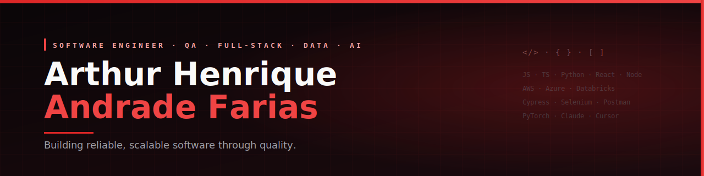
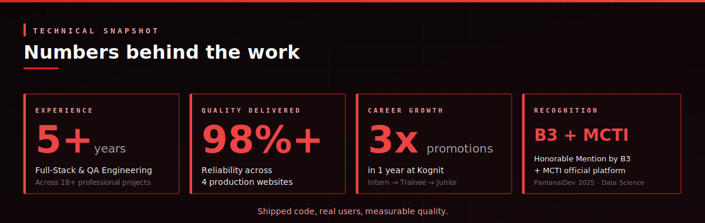

<div align="center">



<br/>

<a href="mailto:arthurh.afarias@gmail.com">
  
</a>
<a href="https://www.linkedin.com/in/arthur-henrique-andrade-farias-0884bb233">
  
</a>
<a href="https://arthur-henrique-andrade-farias.github.io/Curriculum/">
  
</a>

<br/>
<br/>


</div>

---

## 👋 Sobre mim

Sou **Engenheiro de Software** com mais de **5 anos de experiência** atuando em diferentes frentes da engenharia: Full-Stack Development, QA Automation, Data Engineering e IA aplicada.

Atualmente atuo como **Analista de QA Júnior na Kognit**, onde fui promovido **3 vezes em pouco mais de um ano** — Estagiário (Nov/2024), Trainee (Jun/2025) e Júnior (Nov/2025). Em paralelo, estou finalizando minha graduação em **Ciência da Computação na UFMS** (Dez/2025), com **Especialização em Testes de Software e Automação**.

Acredito que **qualidade não é etapa — é cultura**. Meu foco é construir software escalável, testável e confiável, sempre conectando boas práticas técnicas a impacto real de negócio.

```yaml
nome: Arthur Henrique Andrade Farias
localização: Campo Grande, MS — Brasil 🇧🇷
trabalho: 100% Remoto
idiomas: [Português (nativo), English (fluent), Español (intermedio)]
ferramentas_de_apoio: [Claude, Cursor, ChatGPT]
foco_atual: QA Automation · Data Engineering · Back-End
graduação: Ciência da Computação — UFMS (Dez/2025)
```

---

## 🏆 Reconhecimentos

- 🥈 **Menção Honrosa pela B3** — PantanalDev 2025 · Módulo Ciência de Dados
- 🏛️ **Plataforma oficial do MCTI** — App de reconhecimento de fauna e flora desenvolvido no LEDES/UFMS, adotado como ferramenta oficial do Ministério da Ciência, Tecnologia e Inovação
- 🥇 **Melhor Projeto** — SECOMP UFMS 2024
- 🤖 **Membro do Conselho Consultivo** — AraraBots (mentoria técnica)
- 💻 **Maratona SBC de Programação** — 2023 e 2024
- 📐 **Olimpíada Brasileira de Informática (OBI)** — 2022

---

## 🛠️ Stack Técnica

### Linguagens


### Front-End


### Back-End


### Bancos de Dados


### QA & Automação


### Data & IA


### DevOps & Cloud


### IA-Assisted Development


---

## 💼 Experiência Profissional

### 🔴 Analista de QA Júnior — Kognit
**Nov/2025 — Presente** · 100% Remoto

Liderança de estratégia de testes, mentoria de membros mais novos do time e ownership de pipelines de CI/CD. Atuação com automação E2E (Cypress, Selenium), testes de API (Postman, Newman) e gestão completa do ciclo de vida de defeitos via Jira.

### 🔴 Engenheiro de Dados — Liven
**Jul/2025 — Mar/2026**

Pipelines de dados em **Databricks** com **Arquitetura Medallion** (Bronze, Silver, Gold), sustentando soluções de IA e chatbots em produção. Stack: Python, PySpark, SQL, Power BI.

### 🔴 Desenvolvedor Full-Stack — Agro Field Sheet
**Ago/2025 — Abr/2026**

Plataforma web e mobile para gestão agrícola. Stack: PHP, Laravel, MySQL, Redis, WebSockets, deploy em DigitalOcean.

### 🔴 Especialista em Reconhecimento Facial (Freelance)
**Jan/2025 — Abr/2025**

Sistema completo de identificação facial para controle de acesso. Treinei modelo CV próprio em **PyTorch**, integrei câmeras IP em tempo real e construí back-end com Django + front-end com Angular.

### 🔴 Analista de Dados — Branding
**Out/2024 — Jan/2025**

Análise e validação de dados de campanhas SENAI com Python (Pandas/NumPy), SQL e Power BI. Precisão superior a 90% em validação de dados complexos.

### 🔴 Desenvolvedor Full-Stack — CigarrinhaWeb / IDR-Paraná
**Jun/2024 — Jul/2025**

Plataforma de pesquisa agrícola com Vue.js + Node.js + PostgreSQL, incluindo dados geoespaciais. Sistema formalizado via **Registro de Software** no MCTI.

### 🔴 Desenvolvedor Full-Stack Júnior — VJ Bots
**Mai/2024 — Abr/2025**

Sites e dashboards com React, React Native e TypeScript, além de RPA em Python (Sikuli, Playwright). O site principal passou a responder por **40% da receita** da empresa.

### 🔴 QA Tester & Desenvolvedor Mobile/IA — LEDES / UFMS
**Dez/2022 — Ago/2024**

Aplicativo móvel de reconhecimento de fauna e flora brasileira via IA. **Adotado como plataforma oficial pelo MCTI**. Stack: Flutter, Dart, Python, PyTorch, MongoDB.

### 🔴 Desenvolvedor Full-Stack — EVEVOsoft
**Mar/2021 — Abr/2022**

Plataforma corporativa para a indústria sucroenergética com React, Node.js, MySQL e AWS (EC2, RDS, S3, IAM, VPC, CloudWatch).

### 🔴 Dentre outras...
---

## 📊 Stats

<div align="center">



</div>

---

## 🎓 Formação & Certificações

- 🎓 **Bacharelado em Ciência da Computação** — UFMS (Dez/2025)
- 📜 **Especialização em Testes de Software e Automação** (Abr/2024)
- 📜 **Google Data Analytics Professional Certificate** (Mar/2024)
- 📜 **Full-Stack Web Development with React** (Dez/2023)
- 📜 **Flutter and Dart: The Complete Guide** (Fev/2023)
- 📜 **Laravel** — 4 cursos especializados
- 📜 **Python Journey** — desenvolvimento completo

---

## 📫 Vamos conversar?

Estou aberto a oportunidades em **QA Automation**, **Engenharia de Dados** e **Desenvolvimento Back-End / Full-Stack**, seja em **CLT** ou **PJ**, **100% remoto**.

<div align="center">

| Canal | Contato |
|:--:|:--:|
| 📧 Email | [arthurh.afarias@gmail.com](mailto:arthurh.afarias@gmail.com) |
| 📱 WhatsApp | +55 (67) 99803-6052 |
| 💼 LinkedIn | [arthur-henrique-andrade-farias](https://www.linkedin.com/in/arthur-henrique-andrade-farias-0884bb233) |
| 🌐 Portfolio | [arthur-henrique-andrade-farias.github.io/Curriculum](https://arthur-henrique-andrade-farias.github.io/Curriculum/) |

<br/>

<sub><i>"Qualidade não é uma etapa. É como eu penso desde a primeira linha de código."</i></sub>

</div>
